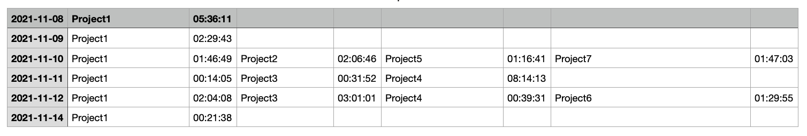

# Описание

Скрипт упрощает формирование отчетов из [hubstaff](https://hubstaff.com/) за n-дней из всех проектов.

### Пример сформированного отчета

# Установка

- Генерируем токен https://developer.hubstaff.com/personal_access_tokens
- Устанавливаем зависимости pip install -r requirements.txt
- Заходим в папку hubstaff, копируем содержимое .env_example в файл .env
- Вставляем токен в TOKEN_HUBSTAFF
- Меняем переменные start_data и stop_data в main.py (максимальный интервал 31 день)
- Запускаем main.py и открываем report.csv